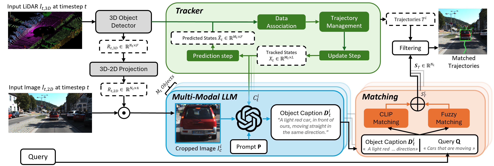

# ReferGPT: Towards Zero-Shot Referring Multi-Object Tracking

## Methodology 

  

## Installation
TBD

## Results
| **Dataset**   | **HOTA** | **DetA** | **DetRe** | **DetPR**| **AssA** | **AssRe** | **AssPr**| **LocA** |
|---------------|----------|----------|-----------|----------|----------|-----------|----------|----------|
|**Refer-KITTI**      |  49.46   |  39.43   |   50.21   |   58.91  |   62.57  |   73.74   |   72.78  |   81.85  |
|**Refer-KITTIv2**     |  30.12   |  15.69   |   21.55   |   34.41  |   59.02  |   74.59   |   68.20  |   79.76  |
|**Refer-KITTI+**      |  43.44   |  29.89   |   36.59   |   56.98  |   63.60  |   75.20   |   73.27  |   82.23  |

## Acknowledgement 

The work is supported by the ”Onderzoeksprogramma Artificiele Intelligentie (AI) Vlaanderen” programme and by Innoviris within the research project TORRES. N. Deligiannis acknowledges support from the Francqui Foundation (2024-2027 Francqui Research Professorship). 

## Citation 
TBD 
